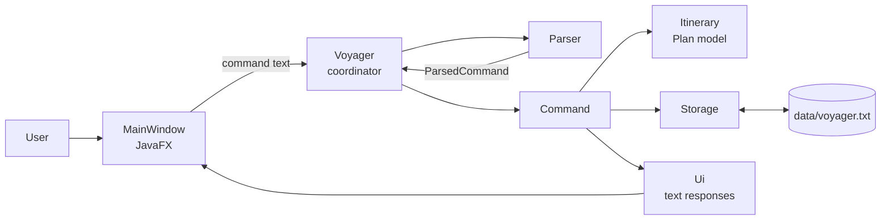
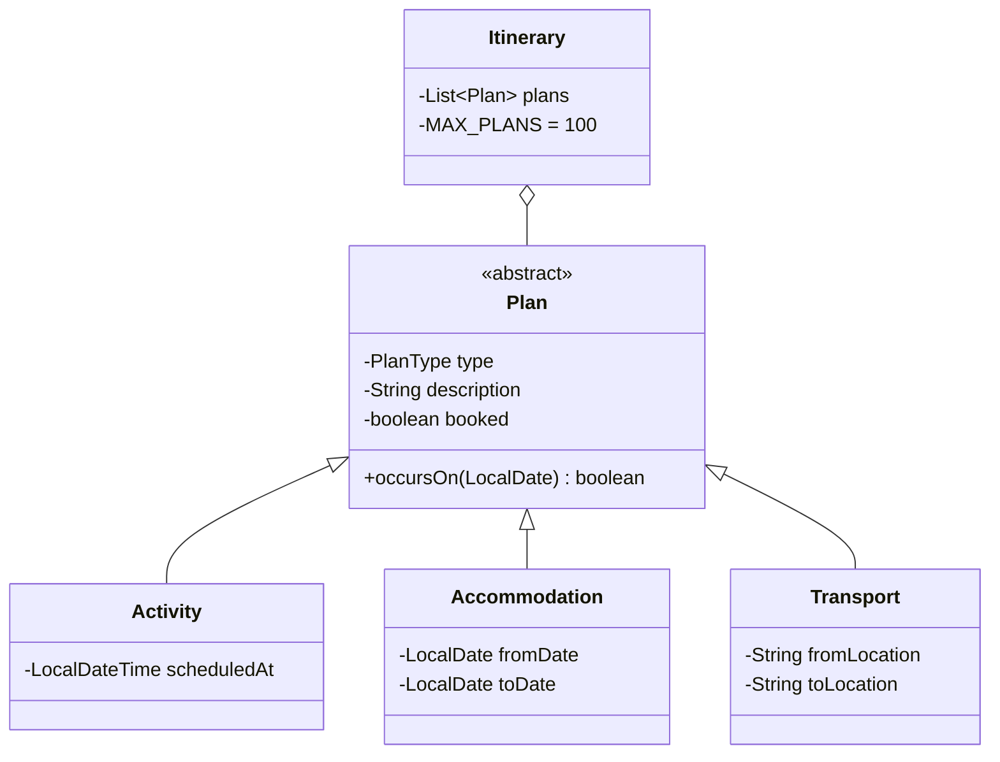

# Voyager Developer Guide

## 1. Introduction

Voyager is a desktop travel-planning chatbot. It lets a user add activities,
accommodation, and transport to one itinerary; book or unbook items; delete,
find, and view them; and retain the itinerary between launches.

This guide describes the **current `master` source tree** (the product after
the `v0.1.0` tag), not just the tagged release. The public-facing command
reference is in the [User Guide](README.md).

### 1.1 Setting up and building

Use JDK 25. The Gradle Wrapper selects the project's declared Gradle version,
so developers should not rely on a separately installed Gradle distribution.

```bash
./gradlew --quiet run       # launch the JavaFX application
./gradlew test              # run the JUnit suite
./gradlew check             # run tests and Checkstyle checks
```

On macOS systems using SDKMAN, activate the expected JDK before executing Java
commands:

```bash
sdk use java 25.0.3.fx-zulu
```

The application entry point is `voyager.Launcher`. It launches JavaFX's
`MainWindow`, which constructs the application coordinator with the default
data file `data/voyager.txt`.

## 2. Architecture

Voyager has a deliberately small layered design. The JavaFX window owns
presentation concerns; `Voyager` coordinates an operation; the parser turns
text into validated data; command objects mutate or query the model; and
storage persists a complete snapshot.



`Ui` writes text responses to a `PrintStream`. In the graphical application,
`MainWindow` gives it an in-memory stream, reads the response after each
command, and renders it as a chat bubble. This keeps command responses shared
between the console-oriented application core and the GUI without making model
or command code depend on JavaFX.

### 2.1 Main components

| Component | Responsibility | Important classes |
| --- | --- | --- |
| UI | Renders the JavaFX window, conversation, itinerary sidebar, and command reference. | `MainWindow`, `Launcher` |
| Coordinator | Loads state, dispatches parsed commands, tracks whether the last response was an error. | `Voyager` |
| Parser | Normalises whitespace/casing and validates command syntax before execution. | `Parser`, `ParsedCommand` |
| Commands | Encapsulate one user operation, including persistence and rollback for changes. | `Command` and its subclasses |
| Model | Holds itinerary items and domain rules such as capacity, duplicates, booking state, and date filtering. | `Itinerary`, `Plan`, `Activity`, `Accommodation`, `Transport` |
| Storage | Loads valid records and atomically replaces the saved snapshot. | `Storage` |
| Text output | Formats user-facing responses and records whether the last response was an error. | `Ui`, `VoyagerException` |

### 2.2 Control flow

For a normal graphical command, `MainWindow.submitCommand()` displays the user
text and delegates it to `Voyager.handleCommand()`. `Voyager` clears the
previous response status, asks `Parser` for a `ParsedCommand`, selects the
matching `Command` subclass, and executes it. A `VoyagerException` represents a
validation or domain error that is safe to show to the user. The coordinator
then returns whether the program should remain open.

The `help` command is intentionally a GUI-only convenience: `MainWindow`
intercepts it and toggles the command-reference panel rather than passing it to
the parser. `exit` is parsed into `ExitCommand`; the window closes after the
command signals that execution should stop.

When a command succeeds, the sidebar is rebuilt from the current itinerary in
one-based display order. When it fails, the sidebar is left untouched. This is
why `Ui` exposes the last-response error state to the coordinator/window.

## 3. Domain model and rules

`Plan` is the abstract base class for all itinerary items. It contains the
common description and booking state. `PlanType` supplies the type name and
display marker. The subclasses add their specific data:



The following invariants are enforced in the model and command layer:

- An itinerary contains at most 100 plans. User-visible plan numbers are
  one-based, and removing an item renumbers the remaining items.
- A duplicate is rejected when the type, description, and all type-specific
  details are equal; its booking state is deliberately ignored.
- A stay's start date must be before its end date. A stay is considered to
  occur on every date in its inclusive range; a dated activity occurs only on
  its scheduled date. Transport and undated activities do not occur on a date.
- `book` and `unbook` reject an invalid number and a request for the existing
  state.
- `find` requires every supplied keyword to occur in a description,
  case-insensitively, and preserves original plan numbers in its result.

## 4. Parsing and commands

`Parser` is the only component that interprets raw command text. It trims the
input, recognises the first word case-insensitively, and produces a nested
`ParsedCommand` containing only validated arguments. It uses `java.time` for
date validation and clear format-specific error messages. `/from` and `/to`
markers are recognised case-insensitively as separate tokens, preventing
ambiguous route/stay input.

| Command | Parsed result | Execution effect |
| --- | --- | --- |
| `activity` | Description and optional `LocalDateTime` | Adds an `Activity` |
| `stay` | Name, start date, end date | Adds an `Accommodation` |
| `transport` | Name, origin, destination | Adds a `Transport` |
| `book` / `unbook` | Positive item number | Changes booking state |
| `delete` | Positive item number | Removes the item |
| `view` | `LocalDate` | Displays date-matching plans |
| `find` | Normalised keywords | Displays matching plans |
| `list` | No arguments | Requests a sidebar refresh acknowledgement |
| `exit` | No arguments | Ends the application |

### 4.1 Command extensibility

To add a command, update these locations together:

1. Add a `CommandType` and parsing branch in `Parser`; validate all input here.
2. Add a `Command` subclass that queries or changes `Itinerary` and calls
   `Ui` for the response.
3. Dispatch the parsed type in `Voyager.handleCommand()`.
4. Add the command to `MainWindow.COMMAND_REFERENCE` and the User Guide.
5. Add unit tests, then add positive and invalid-input UI cases to
   `test/ui-test-plan.md`.

For a state-changing command, ensure failed persistence restores the exact
pre-command state before displaying `Unable to save data.`. The add commands
remove their just-added plan, `BookingCommand` restores the previous flag, and
`DeleteCommand` restores the removed plan at its original position.

## 5. Persistence

`Storage` owns the file format and provides `load()` and `save(Itinerary)`.
The data file is a UTF-8, line-oriented snapshot. Each record has a type code,
a `0`/`1` booking flag, then URL-safe Base64-encoded text fields separated by
` | `. Base64 preserves arbitrary user text without allowing it to break the
delimiter. Example (illustrative only):

```text
A | 0 | TXVzZXVt
S | 1 | Q2l0eSBIb3RlbA | MjAyNi0wOS0wMQ | MjAyNi0wOS0wMw
T | 0 | QWlycG9ydCBTaHV0dGxl | Q2hhbmdp | Q2l0eSBIYWxs
```

Loading a missing file creates an empty itinerary. For an existing file,
malformed, duplicate, or over-capacity records are skipped while valid records
remain in file order; the user receives one corruption warning. An unreadable
file prevents the command loop from starting, avoiding writes over data that
could not be safely read.

Saving first writes the entire snapshot to a temporary sibling file and then
moves it over the destination, preferring an atomic move. This prevents a
partial write from replacing a previously valid save. Commands also perform
in-memory rollback if `save` throws an `IOException`, so memory and disk do
not silently diverge after a failed update.

## 6. Software engineering process

### 6.1 Development approach

The project evolves feature-by-feature: model and parser changes are isolated
from presentation, and a command class captures the behaviour of each
operation. This provides small reviewable changes and keeps the UI from
containing business rules. Assertions document key internal persistence
invariants; they complement, rather than replace, tests and validation.

Before changing Java production code, follow the local
`seedu-java-coding-standard` skill and the configured SE-EDU Java style.
Classes and non-obvious behaviour use Javadoc, and Checkstyle enforces the
rules during the build.

Before making a commit, follow the local `seedu-git-standard` skill. Do not
commit or push changes unless explicitly authorised. The repository keeps the
Gradle Wrapper under version control so all developers execute a consistent
build.

### 6.2 Testing strategy

The JUnit 6 suite under `src/test/java` tests the system at several levels:

- **Model tests** cover plan formatting, date inclusion, duplicate detection,
  100-item capacity, ordering, removal, and restoration.
- **Parser tests** cover valid syntax plus empty, malformed, boundary, and
  overflowing inputs.
- **Command and coordinator tests** check state changes, errors, persistence,
  and rollback when saving fails.
- **Storage tests** verify round trips, absent paths, malformed and duplicate
  records, legacy undated activities, and I/O failure paths.
- **UI tests** check exact response text and response-error status.

Run the full unit suite with `./gradlew test`. Its HTML report is written to
`build/reports/tests/test/index.html`.

The executable UI regression scenarios live in
`test/ui-test-plan.md`. They pair scripted console inputs with exact expected
output and include positive, negative, boundary, corruption-recovery, and
cross-restart cases. After any code change, review affected JUnit tests and
the UI test plan, then run:

```bash
python3 test-ui/scripts/run_ui_tests.py test/ui-test-plan.md
```

The helper is deliberately fail-fast and exact apart from platform line endings
and a final newline. Do not modify expected output merely to hide a failure;
report the expected and actual output, diagnose the discrepancy, then make a
deliberate correction.

### 6.3 Change checklist

1. Understand the requested user behaviour and identify the responsible layer.
2. Make the smallest coherent implementation change, preserving the model and
   persistence invariants.
3. Add or update JUnit tests for positive, negative, boundary, and malformed
   inputs.
4. Update the User Guide and UI test plan if the command-line contract or
   graphical interaction changes.
5. Run `./gradlew test`, the UI test runner, and `./gradlew check` before
   handing off the change.
6. Review the diff for accidental generated files or data files; commit only
   with explicit approval and a descriptive message.

## 7. Project layout

```text
src/main/java/voyager/
  command/      Command objects
  exception/    User-facing checked exception
  model/        Itinerary and plan types
  parser/       Command parsing and validation
  storage/      Snapshot persistence
  ui/           Text response formatter
  MainWindow    JavaFX presentation
  Voyager      Application coordinator
src/test/java/voyager/  JUnit tests mirroring production packages
test/ui-test-plan.md     Human-readable and executable UI scenarios
test-ui/                 Exact-output UI test runner and instructions
config/checkstyle/       SE-EDU style configuration
docs/                    User and developer documentation
```

## 8. Acknowledgements

Voyager is based on the [SE-EDU Duke project template](https://github.com/se-edu/duke).
The template supplied the initial project structure, Gradle-wrapper setup,
contributor/documentation scaffolding, and educational Java/JavaFX testing
materials. The repository history retains the original attribution to Jeffry
Lum and Damith C. Rajapakse in [CONTRIBUTORS.md](../CONTRIBUTORS.md).

The project reuses the SE-EDU
[intermediate Java coding standard](https://se-education.org/guides/conventions/java/intermediate.html)
through its Checkstyle configuration. It uses the [OpenJFX documentation](https://openjfx.io/openjfx-docs/)
for the JavaFX platform and setup, the [Gradle Wrapper documentation](https://docs.gradle.org/current/userguide/gradle_wrapper.html)
for the reproducible build-wrapper approach, and the [JUnit User Guide](https://docs.junit.org/current/user-guide/)
for the JUnit test framework. These external projects and documents are cited
for the ideas, code/configuration, or documentation reused; all Voyager
application-specific behaviour and prose in this guide are maintained in this
repository.
